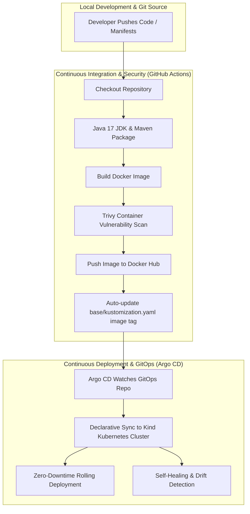

# 🚀 Expenses Tracker — DevSecOps & GitOps Enterprise Pipeline

A production-grade, end-to-end **DevSecOps & GitOps** implementation for a 3-tier Spring Boot Java application and MySQL database running on Kubernetes (Kind).

This repository contains **both the application source code and declarative Kustomize manifests**, operating as a complete all-in-one GitOps repository powered by **GitHub Actions, Trivy Security Scanning, Docker Hub, and Argo CD**.

---

## 📸 Screenshots & Live UI

### 🐙 Argo CD GitOps Dashboard & Application Topology
| Argo CD Application Health Status | GitOps Live Topology Tree |
| :---: | :---: |
|  |  |

---

### 💳 Expenses Tracker Web Application
| Landing & About Page | Add Expense Screen |
| :---: | :---: |
|  |  |

---

## 🏗️ Architecture Overview



---

## 🛠️ Technology Stack & Tools

| Category | Tools & Technologies |
| :--- | :--- |
| **Application Layer** | Java 17, Spring Boot, Spring Security, Thymeleaf, Hibernate JPA |
| **Database Layer** | MySQL 8.0 (StatefulSet with Persistent Volume Claim) |
| **Containerization** | Docker, Multi-stage Image Tagging |
| **CI/CD Pipeline** | GitHub Actions |
| **Security Scanning** | Trivy Container Security Scanner (CRITICAL & HIGH severity checks) |
| **Container Registry** | Docker Hub (`sudarshan0907/expenses-tracker`) |
| **GitOps Engine** | Argo CD (Automated Sync, Prune, Self-Healing) |
| **Kubernetes Deployment** | Kustomize (Base & Kind Overlay), Kind (Kubernetes-in-Docker) |

---

## 📂 Repository Layout

```
Expenses-Tracker-GitOps/
├── .github/workflows/
│   └── ci.yml                 # Automated CI/CD, Trivy scan & GitOps tag updater
├── argocd/
│   └── application.yaml       # Argo CD Application CRD definition
├── assets/                    # Screenshots and architecture diagrams
│   ├── app_add_expense.png
│   ├── app_homepage.png
│   ├── argocd_healthy_card.png
│   └── argocd_topology_tree.png
├── base/
│   ├── app-deployment.yaml   # Spring Boot Deployment (2 Replicas, SecurityContext, Probes)
│   ├── app-service.yaml      # ClusterIP Service for Spring Boot
│   ├── db-secret.yaml        # Encoded DB Credential Secret
│   ├── db-statefulset.yaml   # MySQL 8.0 StatefulSet with PVC
│   ├── mysql-service.yaml    # Headless ClusterIP Service for MySQL
│   ├── namespace.yaml        # `expenses` Namespace
│   └── kustomization.yaml    # Base Kustomize manifest with image tag
├── overlays/
│   └── kind/                 # Kind cluster local overlay (NodePort 30080 patch)
├── src/                      # Java Spring Boot source code
├── Dockerfile                # Multi-stage Dockerfile
├── pom.xml                   # Maven project descriptor
└── README.md                 # Project documentation
```

---

## 📖 How to Use the Application (Step-by-Step User Guide)

### 1. Access the Application
Open your browser and navigate to:
👉 **[http://localhost:8088](http://localhost:8088)**

### 2. Sign Up a New User Account
1. Click on **SIGN UP** in the top navigation bar.
2. Enter your Full Name, Email Address, and Password.
3. Click **Submit** to register your account.

### 3. Sign In to Your Dashboard
1. Click on **SIGN IN** in the top navigation bar.
2. Log in using your registered Email and Password.

### 4. Add & Track Expenses
1. Click **ADD EXPENSE** in the navbar.
2. Select an Expense Category (e.g. *Groceries, Bills, Entertainment, Travel*).
3. Enter the Amount spent, Date & Time, and a short Description.
4. Click **Submit** to record the transaction into MySQL.

### 5. View Expense Reports
1. Click **SHOW EXPENSES** to view all recorded transactions formatted cleanly in your table dashboard.

---

## 🚀 Deployment & Operations Guide

### 1. Prerequisites
Ensure you have installed:
- `docker`
- `kind`
- `kubectl`

### 2. Create Kind Cluster
```bash
kind create cluster --name tws-cluster
```

### 3. Deploy Argo CD
```bash
kubectl create namespace argocd
kubectl apply -n argocd -f https://raw.githubusercontent.com/argoproj/argo-cd/stable/manifests/install.yaml
```

### 4. Deploy Expenses Tracker Application via Argo CD
```bash
kubectl apply -f argocd/application.yaml
```

### 5. Access Dashboards & Port Forwarding

* **Argo CD UI**:
  ```bash
  kubectl port-forward svc/argocd-server -n argocd 8443:80 --address 0.0.0.0
  ```
  👉 Open: **[http://localhost:8443](http://localhost:8443)**

* **Expenses Tracker Web App**:
  ```bash
  kubectl port-forward svc/expenses-tracker -n expenses 8088:80 --address 0.0.0.0
  ```
  👉 Open: **[http://localhost:8088](http://localhost:8088)**

---

## 🛡️ Key Security Features Implemented

1. **Non-Root Container Execution**: App and DB containers run with restrictive `securityContext` (`runAsNonRoot: true`, `runAsUser: 1000`).
2. **Automated Vulnerability Scanning**: Integrated Trivy container scanner in GitHub Actions to detect `CRITICAL` or `HIGH` severity vulnerabilities.
3. **Secret Encapsulation**: Database credentials managed via Kubernetes Secrets rather than hardcoded environment variables.
4. **Init Container Dependency**: Spring Boot pod uses an init container (`busybox`) to wait for MySQL port `3306` readiness before launching the app.

---

## 🧪 GitOps Demonstrations

### 🔁 Demo A: Self-Healing & Drift Correction
Manually break replica count using `kubectl`:
```bash
kubectl scale deployment expenses-tracker -n expenses --replicas=1
```
Watch Argo CD detect the drift and automatically **self-heal** back to 2 replicas!

### 🏷️ Demo B: Automated End-to-End CI/CD Rollout
Push any change to `main` branch:
```bash
git commit --allow-empty -m "demo: trigger CI/CD pipeline"
git push origin main
```
GitHub Actions will build, scan, push to Docker Hub, update `base/kustomization.yaml`, and Argo CD will perform a **zero-downtime rolling update**!
