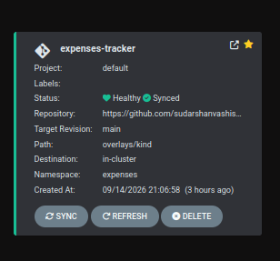
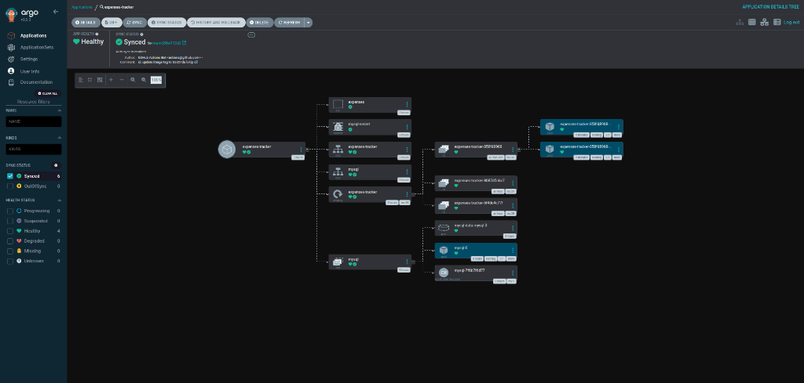
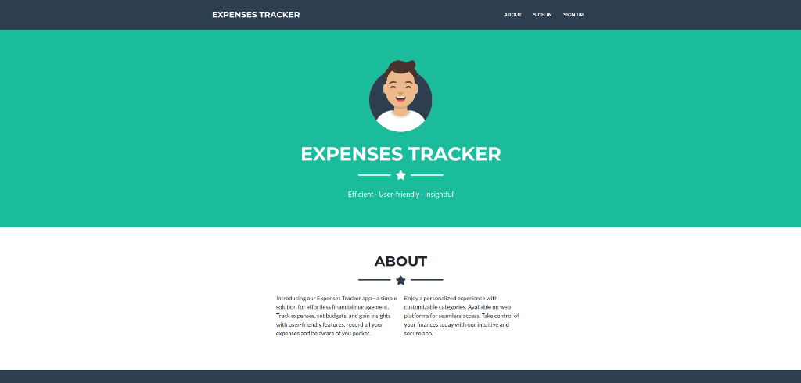
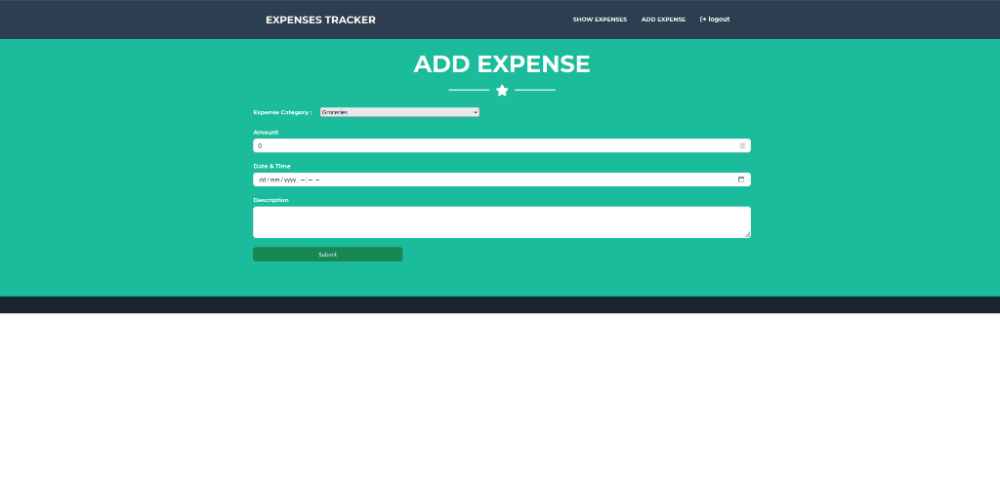
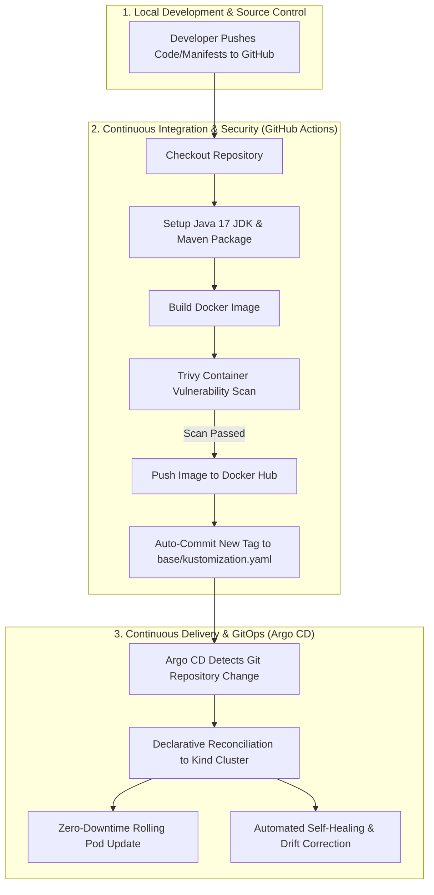

# 🚀 Expenses Tracker — Enterprise DevSecOps & GitOps Pipeline

[](https://kubernetes.io/)
[](https://argoproj.github.io/cd/)
[](https://github.com/features/actions)
[](https://trivy.dev/)
[](https://hub.docker.com/)
[](https://spring.io/projects/spring-boot)

A production-grade, end-to-end **DevSecOps & GitOps** implementation for a 3-tier Spring Boot Java application and MySQL database running on local Kubernetes (`Kind`).

This repository operates as a unified, single-source-of-truth GitOps repository containing **both application source code and declarative Kustomize infrastructure manifests**.

---

## 📸 Executive Visual Summary

### 🐙 GitOps Control Plane (Argo CD)
| Application Health Status | Live Cluster Topology Tree |
| :---: | :---: |
|  |  |

### 💳 Expenses Tracker Web Interface
| Application Landing & About | Add Expense Screen |
| :---: | :---: |
|  |  |

---

## 🏗️ Architecture & DevSecOps Workflow



---

## 🛠️ Technology Stack

| Domain | Technologies |
| :--- | :--- |
| **Backend Framework** | Java 17, Spring Boot 3, Spring Data JPA, Hibernate |
| **Frontend Templates** | Thymeleaf, HTML5, CSS3, JavaScript |
| **Database Engine** | MySQL 8.0 (StatefulSet with Persistent Volume Claim) |
| **Containerization** | Docker (Multi-stage build), Distroless runtime patterns |
| **Orchestration** | Kubernetes (Kind - Kubernetes in Docker) |
| **Manifest Management** | Kustomize (`base` and `overlays/kind` hierarchy) |
| **GitOps Engine** | Argo CD (Automated Sync, Prune, Self-Healing) |
| **CI/CD Pipeline** | GitHub Actions Workflow (`.github/workflows/ci.yml`) |
| **Security Scanner** | Aqua Security Trivy (Vulnerability Audit for CRITICAL/HIGH CVEs) |
| **Registry** | Docker Hub (`sudarshan0907/expenses-tracker`) |

---

## 📂 Repository Structure

```text
Expenses-Tracker-GitOps/
├── .github/
│   └── workflows/
│       └── ci.yml                 # Automated CI/CD, Trivy scanning & GitOps tag updater
├── argocd/
│   └── application.yaml       # Argo CD Application Custom Resource Definition (CRD)
├── assets/                    # Project screenshots and visual demo assets
│   ├── app_add_expense.png
│   ├── app_homepage.png
│   ├── argocd_healthy_card.png
│   └── argocd_topology_tree.png
├── base/
│   ├── app-deployment.yaml   # Spring Boot Deployment (2 Replicas, SecurityContext, Probes)
│   ├── app-service.yaml      # ClusterIP Service for Spring Boot
│   ├── db-secret.yaml        # Base64-encoded MySQL Secret
│   ├── db-statefulset.yaml   # MySQL 8.0 StatefulSet with 1Gi PVC
│   ├── mysql-service.yaml    # Headless ClusterIP Service for MySQL
│   ├── namespace.yaml        # `expenses` Namespace
│   └── kustomization.yaml    # Base Kustomize manifest with image tag
├── overlays/
│   └── kind/                 # Kind local environment overlay (NodePort 30080 patch)
├── src/                      # Java Spring Boot source code
├── Dockerfile                # Multi-stage Docker build file
├── pom.xml                   # Maven project dependencies
└── README.md                 # Project documentation
```

---

## ⚡ Local Setup & Deployment Guide (Step-by-Step)

Follow these step-by-step instructions to run the entire DevSecOps & GitOps pipeline on your local laptop (Linux, macOS, or Windows WSL2).

### 1. Prerequisites
Before starting, ensure your laptop has the following CLI tools installed:

* [Docker Desktop / Docker Engine](https://docs.docker.com/get-docker/) (running)
* [Kind (Kubernetes in Docker)](https://kind.sigs.k8s.io/docs/user/quick-start/#installation) (`v0.20+`)
* [kubectl](https://kubernetes.io/docs/tasks/tools/) (`v1.28+`)
* [git](https://git-scm.com/)

---

### 2. Clone the Repository
```bash
git clone https://github.com/sudarshanvashisht/Expenses-Tracker-GitOps.git
cd Expenses-Tracker-GitOps
```

---

### 3. Create the Local Kubernetes Cluster
Spin up a multi-node local Kubernetes cluster using `Kind`:
```bash
kind create cluster --name tws-cluster
```

Verify that your cluster nodes are online:
```bash
kubectl get nodes
```

---

### 4. Install Argo CD Control Plane
Deploy Argo CD into your cluster:
```bash
kubectl create namespace argocd
kubectl apply -n argocd -f https://raw.githubusercontent.com/argoproj/argo-cd/stable/manifests/install.yaml
```

Wait until all Argo CD pods are `1/1 Running`:
```bash
kubectl get pods -n argocd --watch
```

---

### 5. Deploy the Application via Argo CD
Apply the Argo CD Application CRD to initiate automated deployment:
```bash
kubectl apply -f argocd/application.yaml
```

Check application synchronization status:
```bash
kubectl get application -n argocd
```

---

### 6. Start Port-Forwarding to Access Live Services

Open a terminal window and start port-forwarding for **Argo CD UI**:
```bash
kubectl port-forward svc/argocd-server -n argocd 8443:80 --address 0.0.0.0
```
👉 Access Argo CD UI: **[http://localhost:8443](http://localhost:8443)**  
* Default Username: `admin`  
* Retrieve Initial Password:
  ```bash
  kubectl -n argocd get secret argocd-initial-admin-secret -o jsonpath="{.data.password}" | base64 -d && echo
  ```

Open a second terminal window and start port-forwarding for **Expenses Tracker Web App**:
```bash
kubectl port-forward svc/expenses-tracker -n expenses 8088:80 --address 0.0.0.0
```
👉 Access Web App: **[http://localhost:8088](http://localhost:8088)**

---

## 📖 How to Use the Web Application

1. **Launch the App**: Open **[http://localhost:8088](http://localhost:8088)** in your browser.
2. **Register an Account**: Click **SIGN UP** in the navbar, enter your Name, Email, and Password, then click **Submit**.
3. **Log In**: Click **SIGN IN** and log in with your new credentials.
4. **Add Expenses**:
   * Click **ADD EXPENSE** in the top navigation.
   * Select a Category (*Groceries, Bills, Entertainment, Travel, etc.*).
   * Enter the Amount, Date/Time, and a short Description.
   * Click **Submit**.
5. **View Reports**: Click **SHOW EXPENSES** to view your financial transactions stored in MySQL.

---

## 🧪 GitOps Demonstrations (Self-Healing & CI/CD)

### 🔁 Demo 1: Automated Self-Healing & Drift Correction
Demonstrate Kubernetes and Argo CD self-healing:
```bash
# Manually delete a running application pod
kubectl delete pod -n expenses -l app.kubernetes.io/name=expenses-tracker --field-selector=status.phase=Running | head -n 1
```
* **Observation**: Open Argo CD UI at [http://localhost:8443](http://localhost:8443). Argo CD instantly detects the missing pod and automatically recreates a new healthy replica without downtime!

---

### 🏷️ Demo 2: Automated End-to-End CI/CD Push Trigger
Trigger an automated CI/CD pipeline run:
```bash
git commit --allow-empty -m "ci: test automated pipeline build and deploy"
git push origin main
```
* **Pipeline Execution**:
  1. GitHub Actions triggers `.github/workflows/ci.yml`.
  2. Maven compiles Java source code & executes tests.
  3. Docker builds the application image and runs **Trivy vulnerability scan**.
  4. Pushes updated image tag to Docker Hub.
  5. Commits updated tag to `base/kustomization.yaml`.
  6. Argo CD detects revision change and performs a **Zero-Downtime Rolling Update**.

---

## 🛡️ Production & Security Best Practices Implemented

1. **Least-Privilege Security Context**: Containers execute as non-root users (`runAsNonRoot: true`, `runAsUser: 1000`) with dropped kernel capabilities (`drop: ["ALL"]`).
2. **Automated Vulnerability Gate**: Trivy security scanner automatically breaks the build if `CRITICAL` or `HIGH` vulnerabilities are introduced.
3. **Init Container Dependency Ordering**: A `busybox` init container (`wait-for-mysql`) polls TCP port `3306` to ensure MySQL is accepting connections before launching the Spring Boot JVM.
4. **Resilient Health Probes**: Configured `readinessProbe` and `livenessProbe` HTTP endpoints to eliminate race conditions during JVM startup.

---

## ❓ Frequently Asked Questions & Troubleshooting

<details>
<summary><b>1. Argo CD shows <code>Progressing</code> status when launching pods</b></summary>

* **Explanation**: Spring Boot takes ~40-45 seconds to initialize Hibernate JPA and open TCP port 8080. During this startup window, Argo CD correctly reports `Progressing` until the readiness probe passes. Once initialized, status automatically updates to `Healthy`.
</details>

<details>
<summary><b>2. Port 8088 or 8443 is already in use</b></summary>

* **Solution**: You can specify any alternative local port during port-forwarding:
  ```bash
  kubectl port-forward svc/expenses-tracker -n expenses 9090:80 --address 0.0.0.0
  ```
  Then open `http://localhost:9090`.
</details>

---

## 📜 License
This project is open-source and available under the [MIT License](LICENSE).
